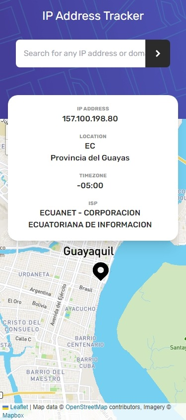

# Frontend Mentor - IP address tracker solution

This is a solution to the [IP address tracker challenge on Frontend Mentor](https://www.frontendmentor.io/challenges/ip-address-tracker-I8-0yYAH0). Frontend Mentor challenges help you improve your coding skills by building realistic projects. 

## Table of contents

- [Overview](#overview)
  - [The challenge](#the-challenge)
  - [Screenshot](#screenshot)
  - [Links](#links)
- [My process](#my-process)
  - [Built with](#built-with)
  - [What I learned](#what-i-learned)
  - [Continued development](#continued-development)
  - [Useful resources](#useful-resources)
- [Author](#author)
- [Acknowledgments](#acknowledgments)

**Note: Delete this note and update the table of contents based on what sections you keep.**

## Overview

This project was built with Parcel.

### Setup

1.  Install dependencies:

```sh
npm install
```

2.  Run dev server:

```sh
npm start
```

3.  Build for production:

```sh
npm run build
```

### The challenge

Users should be able to:

- View the optimal layout for each page depending on their device's screen size
- See hover states for all interactive elements on the page
- See their own IP address on the map on the initial page load
- Search for any IP addresses or domains and see the key information and location

### Screenshot

<p align="center">
    
</p>
<p align="center">
  
</p>

### Links

- Solution URL: [GitHub](https://github.com/ichiklaus/ip-address-tracker.git)
- Live Site URL: [IP Address Tracker](https://ichiklaus-ip-tracker.netlify.app/)

## My process

### Built with

- Semantic HTML5 markup
- Tailwindcss
- Flexbox
- Mobile-first workflow
- [React](https://reactjs.org/) - JS library
- [useSWR](https://swr.vercel.app/) - React Hooks for Data Fetching


### What I learned

This project took me a few days to complete. I decided to step out of my comfort zone from building newbie and (a few) junior projects and jumped into my first intermediate level frontend project. It was challenging. I learned a lot more (though still much more to learn) about hooks, the useSWR hook by [@Vercel](https://github.com/vercel/swr). 
Since I'm using tailwindcss for my projects lately, I found it a bit hard to maintian and read CSS classes within the markup, that's why I took an approach (inspired by [Nikolaus Rademacher's article](https://dev.to/wheelmaker24/a-simple-strategy-for-structuring-tailwindcss-classnames-1ba9)) to "abstract" CSS class names putting them separately in a Styles.js files using JS objects and arrays to access the required classes. 

**Disclaimer**: My tech/developer/programmer language is still basic, meaning that I understand things by watching, trying, testing, and/or realizing, but I still have a hard time putting it in words, plus english is my second language. <br />
In my first attempt using useSWR hook I found that data was fetching more than one time when I implemented it in a child component so I reestructured/refactored it in a way that it's only called on a upper component once (Main, where I pass props values from). <br />
Also, I since useSWR has an automatic revalidation I decided to disable it (by using [useSWRImmutable](https://github.com/vercel/swr/issues/450#issuecomment-922391940) instead of useSWR hook) because the IPIFY API I was working with offers limited requests for one-time-trial free user.

### Continued development

- React Hooks.
- API fetching.

### Useful resources

- [Nikolaus Rademacher's article](https://dev.to/wheelmaker24/a-simple-strategy-for-structuring-tailwindcss-classnames-1ba9) - This helped me to structure Tailwindcss classnames.
- I reviewed code from 3 fellow frontendmentor members to understand how to use the Leaflet API, [nzzCoding
](https://github.com/nzzCoding/); [BelayAdamu](https://github.com/BelayAdamu/); and [reynaldo-bejarano](https://github.com/reynaldo-bejarano/).
- About [useSWRImmutable](https://github.com/vercel/swr/issues/450).

**Note: Delete this note and replace the list above with resources that helped you during the challenge. These could come in handy for anyone viewing your solution or for yourself when you look back on this project in the future.**

## Author

- Frontend Mentor - [@ichiklaus](https://www.frontendmentor.io/profile/ichiklaus)
- Twitter - [@ichiklaus](https://www.twitter.com/ichiklaus)

## Acknowledgments

Check Useful resources section.